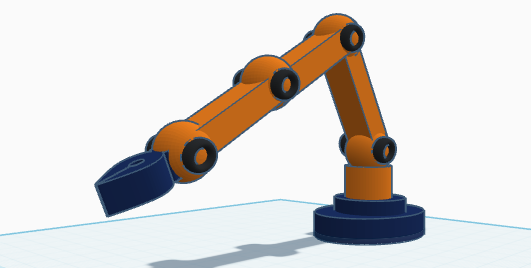

# 3D Robotic Arm – 5 Degrees of Freedom (5 DOF)

This is a simple 3D robotic arm project created using Tinkercad.
The design demonstrates a robotic arm with 5 Degrees of Freedom (DOF) meaning it can move in five different ways — just like a simplified version of a human arm.

# Degrees of Freedom (DOF) 
This robotic arm includes:
1. Base Rotation – Allows the arm to rotate left and right.
2. Shoulder Joint – Moves the arm up and down.
3. Elbow Joint – Bends or extends the arm.
4. Wrist Pitch – Moves the end of the arm up and down.
5. Wrist Roll – Rotates the wrist around its own axis.

# Robotic Arm Preview

# Tinkercad Simulation Link
[Open the 3D Robotic Arm Project](https://www.tinkercad.com/things/3gha2LRzIkv-3drobotarm/edit?returnTo=https%3A%2F%2Fwww.tinkercad.com%2Fdashboard)
